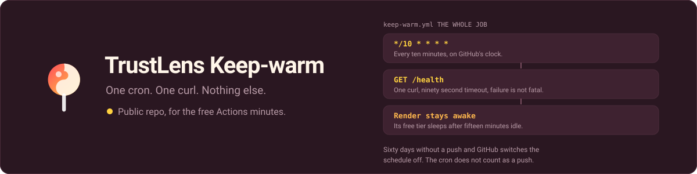

  

  
  
  
  

# trustlens-keepwarm: one cron that keeps the backend awake

A tiny scheduled GitHub Action that pings the TrustLens backend's `/health`
every 10 minutes so Render's free tier doesn't sleep (it naps after ~15 min
idle, which causes a slow cold start on the next scan).

Public repo on purpose: public repos get unlimited free Actions minutes.
No secrets here: the health URL is a public endpoint.

- Ping target: `https://trustlens-backend-djrm.onrender.com/health`
- Schedule: every 10 minutes (`*/10 * * * *`)
- Run it manually any time: Actions tab → keep-warm → Run workflow.

Note: GitHub disables scheduled workflows after 60 days with no repo activity.
Push any commit to re-arm it. Scheduled runs can also be delayed a few minutes
under load; that's fine for keep-warm.

## Where this sits

  

This repository is the small box on the right. It exists for one reason, and
that reason is a line in somebody else's pricing page.

## The 60-day clock

This is the one thing that actually breaks. The cron does not count as repo
activity, so only a push re-arms it. Last re-armed 2026-09-19, which means
the schedule runs until roughly 2026-11-18 without another push.

If it lapses, nothing errors: the workflow simply stops running, Render sleeps
after 15 minutes idle, and the next scan pays a cold start. The fix is a push.

The durable fix is to move this workflow into trustlens-backend, where normal
development keeps the repo active on its own. It lives here only because
public repos get unlimited Actions minutes, and trustlens-backend is public
too, so that reason no longer holds.

## License

MIT. See [LICENSE](LICENSE).

Built by **Igor Lima**. Automation and web work for East County and San Diego
businesses. Portfolio: https://igorcsis.github.io/niftyai-portfolio/
